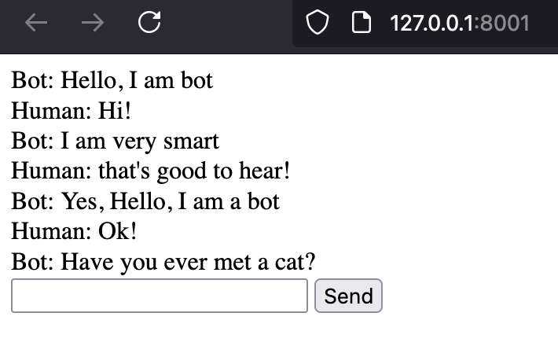

This is a basic example of a chat interface using htmx. It uses starlette as a backend. Should be able to be integrated into a fastapi app, since that uses starlette under the hood.



# Install

```sh
pip install starlette 'uvicorn[standard]'
```

Run

```sh
uvicorn app:app --reload
```

Then open [http://127.0.0.1:8001/](http://127.0.0.1:8001/)!